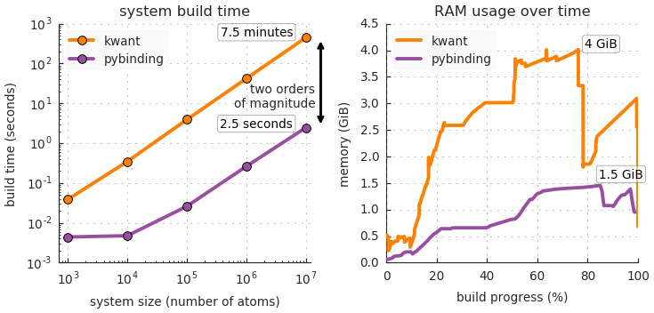

Benchmarks
==========

One of the main features of pybinding is an easy-to-use and fast model builder: it constructs the
tight-binding Hamiltonian matrix. This can be a demanding task for large or complicated systems
(with many parameters). Great care was taken to make this process fast.

We compare the performance of pybinding with the `Kwant package <http://kwant-project.org/>`_.
Both code packages are based on the numerical tight-binding method and can build identical
Hamiltonian matrices. For calculations involving these matrices, the packages specialize in
different ways: Kwant is intended for transport calculations with scattering systems while
pybinding targets large finite-sized and periodic systems in 1 to 3 dimensions. Pybinding can
also be used to construct scattering systems, however it does not have a builtin solver for
transport problems. This is where the :doc:`/advanced/kwant` layer comes in: it's possible to
build a system in pybinding and use Kwant's solvers for transport calculations. This combination
takes advantage of the much faster model builder -- see the comparison below.

System construction
-------------------

The code used to obtain these results is available here: :download:`Source code <system_build.py>`.
You can download it and try it on your own computer. Usage instructions are located at the top
of the script file.

    The results were measured for pybinding v0.8.0 and kwant v1.2.2 using:
    Intel Core i7-4960HQ CPU, 16 GiB RAM, Python 3.5, macOS 10.11. The RAM
    usage was measured using memory_profiler v0.41.

The benchmark constructs a circular graphene flake with a pn-junction and a constant magnetic
field. The system build time is measured from the start of the definition to the point where the
Hamiltonian matrix is fully constructed (a sparse matrix is used in both cases).

Pybinding builds the Hamiltonian much faster than Kwant: by two orders of magnitude. The main
reason for this is in the way the system shape and fields are implemented. Both Kwant and pybinding
take user-defined functions as parameters for model construction. Kwant calls these functions
individually for each atom and hopping which is quite slow. Pybinding stores all atoms and hoppings
in contiguous arrays and then calls the user-defined functions just once for the entire dataset.
This takes advantage of vectorization and drastically improves performance. Similarly, the lower
memory usage is achieved by using arrays and CSR matrices rather than linked lists and trees.

Please note that at the time of writing pybinding v0.8 does lack certain system construction
features compared to Kwant. Specifically, it is currently not possible to build heterostructures
in pybinding, but this will be resolved in the near future. New features will be added while
maintaining good performance.

At first glance it may seem like system build time is not really relevant because it is only done
once and then multiple calculations can be applied to the constructed system. However, every time
a parameter is changed (like some field strength) the Hamiltonian matrix will need to be rebuilt.
Even though Kwant does take this into account and only does a partial rebuild, pybinding is still
much faster and this is very apparent in transport calculations which sweep over some model
parameter. For more information and a direct comparison, see the :doc:`/advanced/kwant` section.
